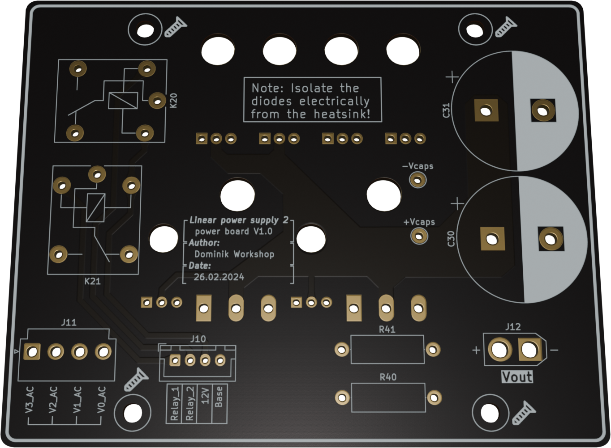

# DW3005T - Linear power supply 2

This is the second iteration of my linear power supply project [available on GitHub](https://github.com/Dominik-Workshop/Linear_power_supply), building upon the foundation of my original design. While the first version served as an excellent learning experience, the DW3005T aims to improve upon its predecessor with enhanced performance, better stability, and a more professional design.

## Used tools:
 &nbsp;&nbsp;&nbsp;&nbsp; &nbsp;&nbsp;&nbsp;&nbsp; 

### Project Goals:
- **30V 5A output**
- **Very small output resistance**
- **Precise voltage, current and power measurements**
- **Small output noise**
- **Digital controll** - rotary encoder

## Electronics
### PCBs:
- Power board

  

&nbsp;

- Control board
> [!WARNING]  
> WORK IN PROGRESS
