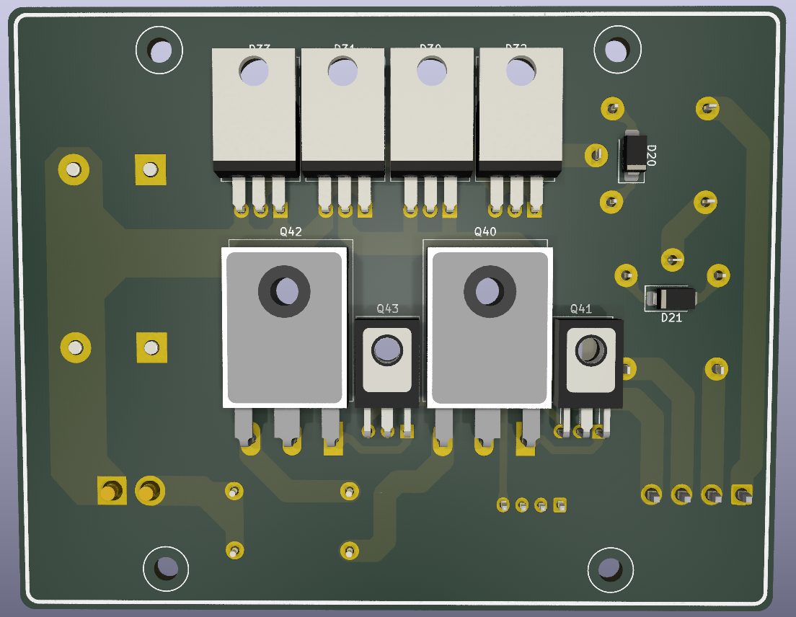

# Linear power supply V2

## Designed in   8.0.0


### Power board

 

### Control board
```
  WORK IN PROGRESS
```

### Project Goals
- **30V 5A output**
- **very small output resistance**
- **precise voltage, current and power measurements**
- **small output noise**
- **digital controll - rotary encoder**